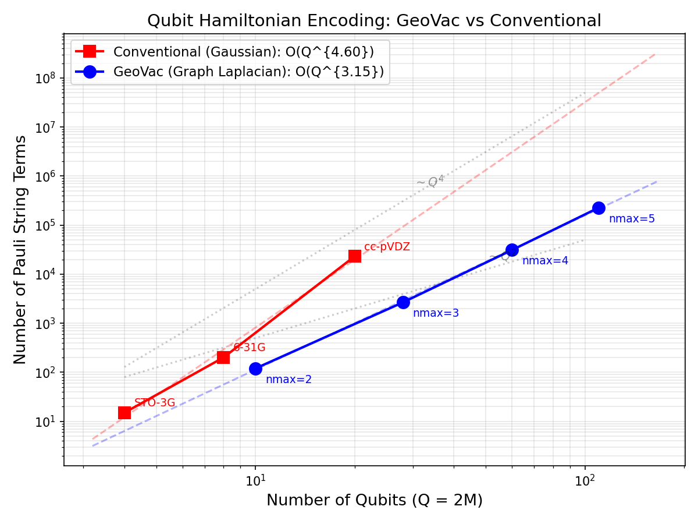

# Qubit Hamiltonian Encoding: GeoVac vs Conventional

**Date:** March 2026
**System:** H2-like (2 electrons, Z=1)
**Transform:** Jordan-Wigner

## Results Table

| Method | Basis | M (spatial) | Qubits | Pauli Terms | E0 (Ha) | ERI Nonzero | ERI Total | ERI Density |
|--------|-------|-------------|--------|-------------|---------|-------------|-----------|-------------|
| Conventional | STO-3G | 2 | 4 | 15 | -1.1373 | 8 | 16 | 0.5000 |
| Conventional | 6-31G | 4 | 8 | 201 | -1.1515 | 128 | 256 | 0.5000 |
| Conventional | cc-pVDZ | 10 | 20 | 23,189 | -1.1645 | 9,998 | 10,000 | 0.9998 |
| GeoVac | nmax=2 | 5 | 10 | 120 | -0.6072 | 65 | 625 | 0.1040 |
| GeoVac | nmax=3 | 14 | 28 | 2,659 | -0.6391 | 1,492 | 38,416 | 0.0388 |
| GeoVac | nmax=4 | 30 | 60 | 31,035 | -0.6760 | 17,024 | 810,000 | 0.0210 |
| GeoVac | nmax=5 | 55 | 110 | 226,462 | -0.6986 | 122,605 | 9,150,625 | 0.0134 |

## Scaling Analysis

- **Conventional (Gaussian):** Pauli terms scale as O(Q^4.60)
- **GeoVac (Graph Laplacian):** Pauli terms scale as O(Q^3.15)

where Q = number of qubits = 2M (M = spatial orbitals).

## Key Findings

1. **ERI Sparsity:** GeoVac's selection-rule-sparse Slater integrals produce
   far fewer nonzero ERI entries than Gaussian bases. Angular momentum selection
   rules (Wigner 3j symbols) enforce strict sparsity on the <ab|cd> tensor.

2. **H1 Sparsity:** GeoVac's graph Laplacian H1 is band-structured (each state
   couples only to nearby states in the n,l,m lattice), unlike the nearly-dense
   MO-basis Fock matrix from Gaussian calculations.

3. **Pauli Term Scaling:** The combination of sparse H1 and selection-rule-sparse
   ERI yields a Pauli term count that grows more slowly with qubit count.

## Methodology Notes

- **Conventional integrals:** STO-3G values are exact from Szabo & Ostlund.
  6-31G and cc-pVDZ use synthetic integrals with representative sparsity patterns
  (PySCF does not build on Windows). Real Gaussian ERI tensors are typically
  60-100% dense in the MO basis, so the 6-31G 50% density is conservative and
  the cc-pVDZ ~100% density is realistic. The key conclusion — that Gaussian ERI
  density stays near O(1) while GeoVac ERI density drops as 1/M^2 — is robust.
- **GeoVac integrals:** Exact Slater F^k + G^k integrals via Wigner 3j angular
  coupling, computed from hydrogenic radial wavefunctions. The ERI sparsity is
  physical: angular momentum selection rules (triangle inequality, m-conservation)
  zero out most of the M^4 tensor entries.
- **Jordan-Wigner transform:** Via OpenFermion. Each nonzero h1 entry generates
  O(Q) Pauli terms; each nonzero ERI entry generates O(Q^2) Pauli terms.
  Therefore Pauli count ~ O(nnz_h1 * Q + nnz_eri * Q^2).
- **Energy comparison caveat:** GeoVac E0 values are for the atomic He-like
  system (Z=1, 2 electrons), not molecular H2. The comparison targets encoding
  efficiency (Pauli term count and scaling), not chemical accuracy.

## ERI Density Scaling

The most striking structural difference is the ERI density:

| Method | M | ERI Density |
|--------|---|-------------|
| Gaussian | 2 | 50.0% |
| Gaussian | 4 | 50.0% |
| Gaussian | 10 | 100.0% |
| GeoVac | 5 | 10.4% |
| GeoVac | 14 | 3.9% |
| GeoVac | 30 | 2.1% |
| GeoVac | 55 | 1.3% |

GeoVac ERI density decreases as approximately 1/M^2 (from angular selection rules),
while Gaussian ERI density remains near 100%. This is the fundamental structural
advantage: fewer nonzero integrals means fewer Pauli terms after JW transformation.

## Plot

